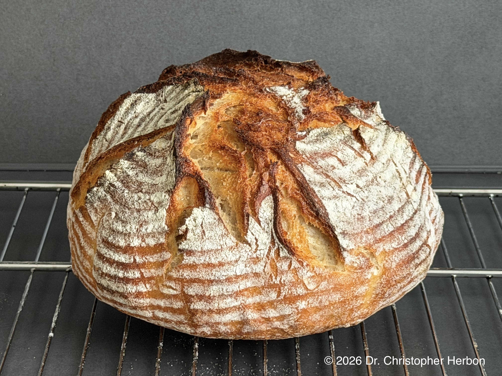
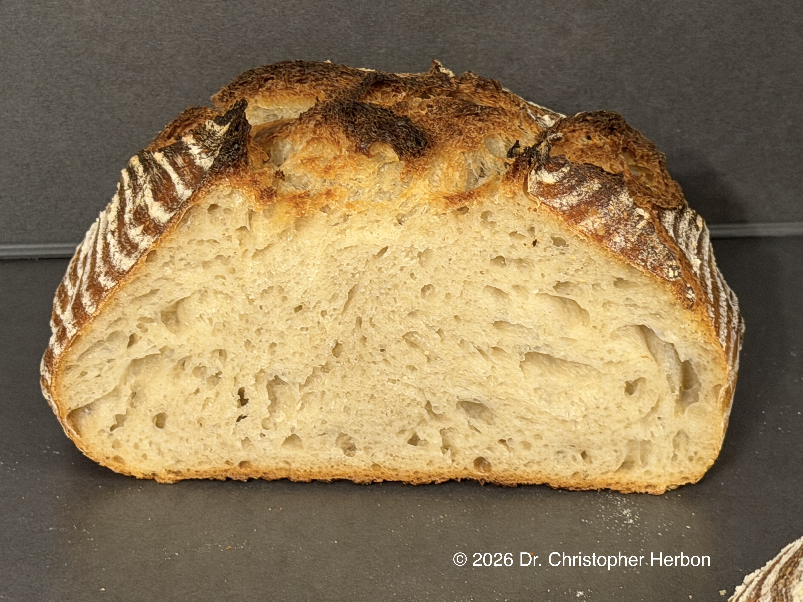

# Rustikales Weizen-Sauerteig-Brot  
  
  
  
Menge für 4 Brote  
  
## Sauerteig  
  
220g Weizenmehl 550  
180g Wasser (31°)  
50g Anstellgut  
  
## Autolyseteig  
  
1880g Weizenmehl 550  
110g Roggenmehl 1150  
1300g Wasser (34°)  
##   
## Hauptteig  
  
gesamter Autolyseteig  
gesamter Sauerteig  
50g Salz  
100g Wasser (34°)  
  
  
## Zubereitung  
  
1. Mindestens einen Tag vorher das Anstellgut aus dem Kühlschrank nehmen und mehrmals füttern, bis der Sauerteig sein Volumen zuverlässig mindestens verdoppelt  
2. Abends den Sauerteig anrühren und über Nacht stehen lassen  
3. Den Autolyseteig anrühren und eine halbe Stunde stehen lassen.  
4. Alle Zutaten zum Hauptteig verrühren  
5. Alle 30 Minuten dehnen und falten, insgesamt viermal  
6. Wenn das Teigvolumen um ca. 50% zugenommen hat (nach ca. 4-5h) den Teig auf eine bemehlte Arbeitsplatte geben und Teiglinge formen  
7. Die Teiglinge mit Schluss nach unten in ein Gärkörbchen geben und 1,5h gehen lassen (alternativ über Nacht in den Kühlschrank stellen)  
8. Im vorgeheizten Backofen bei 240° backen: 20 Minuten im Gusseisentopf und 30 Minuten außerhalb des Topfes  
  
  
  
