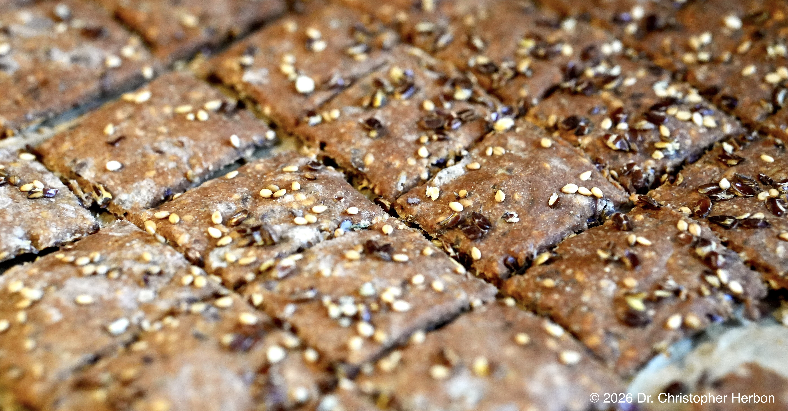

# Sauerteig-Cracker  
  
  
  
## Zutaten  
  
* 75 g Wasser  
* 60 g Sauerteig  
* 90 g Vollkornmehl (beliebig)  
* 3 g Salz  
* 20 g Olivenöl  
* 20 g Sesamsamen  
* 20 g Leinsamen  
  
## Zubereitung  
  
1. Sauerteig im Wasser auflösen  
2. Anschließend Mehl hinzugeben und verrühren  
3. Danach alle anderen Zutaten zugeben und verrühren  
4. Den Teig in reichlich Roggenmehl ein wenig ausrollen  
5. Den Teig auf ein Blatt Backpapier geben und mit einem zweiten Blatt bedecken  
6. Sehr dünn ausrollen (ca. 1mm)  
7. Das obere Backpapier abnehmen, mit Saaten nach Wahl bestreuen und mit einem Nudelholz leicht eindrücken  
8. Im letzten Schritt mit einem Pizzaroller oder einer Teigkante in mundgerechte Stück schneiden  
9. 1h abgedeckt gehen lassen  
10. Bei 180° Umluft ca. 30min backen  
