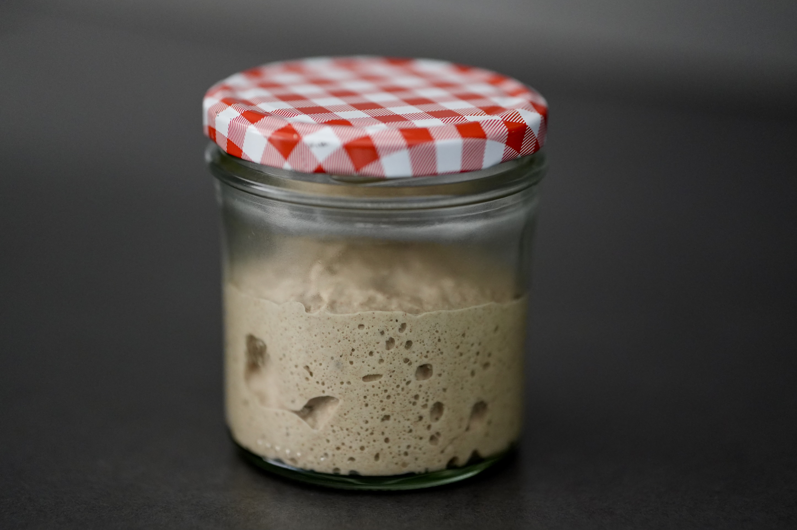

# Sauerteig  
  
  
  
## Kurzfassung  
  
* Im Kühlschrank aufbewahren  
* Füttern: Hälfte entnehmen, 50/50 warmes (!) Wasser/Roggenmehl zugeben und verrühren  
* Wöchentlich füttern  
* Vor dem Backen mind. zweimal bei Raumtemperatur füttern  
* Nach dem Füttern sollte sich das Volumen mind. verdoppeln.  
* Deckel nicht schließen  
  
## Füttern  
  
* Die Hälfte des Sauerteigs wird entnommen und entsorgt.  
* Die andere Hälfte bleibt im Glas und wird mit 30g Roggenmehl 917/1150 und 30g warmem (!) Wasser gefüttert. („warm“ bedeutet: ca. 45°)  
* Wenn man mehr Sauerteig benötigt, kann man auch mehr füttern (z.B. 50g/50g oder 100g/100g). Das Verhältnis sollte gleich bleiben. Es wird dann auch die Hälfte der größeren Menge vor dem Füttern entsorgt.  
* Das Roggenmehl darf nicht zu alt sein, sonst geht der Sauerteig nicht auf.  
* Grundsätzlich ist auch jedes andere Mehl geeignet, man sollte nur bei einer Mehlart bleiben.  
* Je nach Typennummer benötigt das Mehl mehr oder weniger Wasser (kleinere Typennummer -> weniger Wasser, größere Typennummer oder Vollkorn -> mehr Wasser)  
* Der Sauerteig sollte sein Volumen nach dem Füttern innerhalb weniger Stunden mindestens verdoppeln, besser verdreifachen.  
* Mit Hilfe eines Gummibandes kann der Volumenzuwachs beobachtet werden.  
  
  
## Aufbewahrung  
  
* Grundsätzlich wird der Sauerteig im Kühlschrank aufbewahrt - außer zur Vorbereitung auf das Backen (anderenfalls kann er schimmeln).  
* Einmal die Woche sollte der Sauerteig, wie oben beschrieben, gefüttert werden. Dabei sollte er im Kühlschrank trotzdem aufgehen (verdoppeln bis verdreifachen). Geht er nicht oder nicht ausreichend auf, sollte er zweimal am Tag außerhalb des Kühlschranks gefüttert werden, bis er sich wie erwartet verhält.  
* Wichtig: Der Deckel des Glases darf nicht ganz geschlossen, sondern nur leicht aufgelegt werden.  
  
  
## Vorbereitung aufs Backen  
  
* Vor dem Backen sollte der Sauerteig mindestens einen tag vorher aus dem Kühlschrank geholt und zweimal gefüttert werden.  
* Das beste Ergebnis erzielt man, wenn man den Sauerteig schon 2-3 Tage vor dem Backen aus dem Kühlschrank holt und zweimal am Tag füttert.  
* Wenn der Sauerteig kürzlich verwendet wurde, ist auch ein Tag ausreichend.  
* Wichtig ist, dass sich der Sauerteig nach dem Füttern, mindestens verdoppelt. Anderenfalls ist er noch nicht zum Backen bereit.  
* Der Teig ist reif, wenn die Oberfläche leicht einfällt (flach bis konkav). Er kann aber auch schon vorher verwendet werden (steht normalerweise im Rezept).  
  
  
## Allgemeines   
  
* Der Sauerteig sollte einen leicht säuerlichen Geruch haben.  
* Solange der Sauerteig im Kühlschrank aufbewahrt wird, kann das gleiche Glas immer wieder verwendet werden, ohne dass es schimmelt.  
* Anhand der Form der des Teiges im Glas kann man unterscheiden, ob der Sauerteig noch an Volumen zunimmt (konvex) oder bereits reif ist und leicht zusammenfällt (konkav).  
  
  
Konkave Oberfläche: Der Sauerteig geht noch weiter auf.  
  
Konvexe Oberfläche: Der Sauerteig fällt zusammen und ist bereit, genutzt zu werden.  
